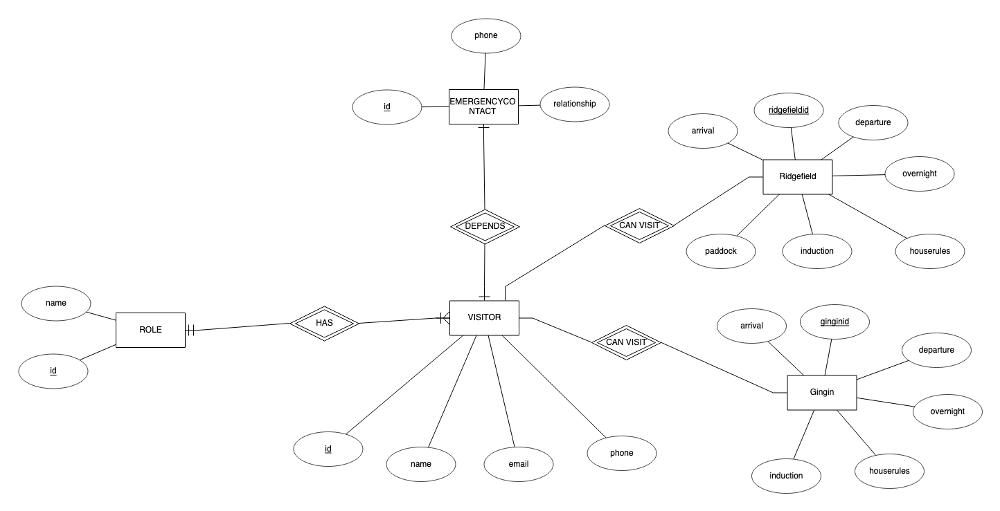

UWA Research Infrastructure Centres Site Registration Application
================================================================
Main Models documentation
------------------
The object relational models (ORM) for the Site Registration Application
intend to fufill the intent of the development of this application as
stated in the Readme.

Models can be updated with the following commands:
    ./manage.py makemigrations visitorsite
    ./manage.py migrate visitorsite

# Visitor Model
In Django, the out-of-the-box `User` model provides the following fields:
* Primary ID (internal use only)
* Username
* First name
* Last name
* E-mail
* Password
* Staff status

Django's authentication system [uses the model `User`](https://docs.djangoproject.com/en/4.1/topics/auth/default/)
to facilitate logging users in and out. The `User` model is intrinsically
linked to the authentication system. Overriding this behaviour is possible,
but is [involved](https://docs.djangoproject.com/en/4.1/topics/auth/customizing/)
 and would violate the 'keep it simple' approach of this 
project.

# Visitor
The `Visitor` model extends the `User` model by applying a one-to-one
foreign key relation with `User`. Staff status is always `False` with
Visitors. This is handled by Django and no further configuration is
needed to handle the staff status for visitors.

| Field | Value type  | Description | Default value |
| --- | --- | --- | --- |
| `id` | Primary ID | Internal use only | The next positive integer |
| `user` | Foreign Key (OneToOneField) | Extends `User` | Required |
| `phone` | Text | Phone number | Required |
| `role` | Foreign Key | One visitor can have one role | Blank |
| `emergencycontact` | Foreign Key | One visitor can have one emergency contact | NULL |

# Visit
The `Visit` model is model (in which developers can extend to easily include
additional sites to this site registration application. This model
is not intended to be used directly (have objects created directly from
this class).

| Field | Value type  | Description | Default value |
| --- | --- | --- | --- |
| `id` | Primary ID | Internal use only | The next positive integer |
| `visitor` | Foreign Key | To identify the visitor | Required |
| `site` | Foreign Key | To identify the site | Required |
| `arrival` | Date + Time (DateTimeField) |  | Required |
| `departure` | Date + Time (DateTimeField) | Estimated | Required |
| `overnight` | Boolean | | False |
| `induction` | Boolean | Only if the visitor is staying overnight | False |
| `houserules` | Boolean | Only if the visitor is staying overnight | False |

Currently, there are two models that extend from `Visit`:
* `GinginVisit`, which has all of the above fields only.
* `RidgefieldVisit`, which has all the above fields and additional fields
as tabulated below:

| Field | Value type  | Description | Default value |
| --- | --- | --- | --- |
| `paddock` | Text | This field can be `NULL` | NULL |

# Role
| Field | Value type  | Description | Default value |
| --- | --- | --- | --- |
| `id` | Primary ID | Internal use only | The next positive integer |
| `name` | Text | Role name (UWA Student, UWA Staff, Contractor, ...) | Blank |

# Emergency Contact
| Field | Value type  | Description | Default Value |
| --- | --- | --- | --- |
| `id` | Primary ID | Internal use only | The next positive integer |
| `name` | Text | First and last names together | Required |
| `phone` | Text | Phone number | Required |
| `relationship` | Foreign Key | Relationship to the visitor (guardian, mother, father,...) | Required |

Auxillary Models documentation
------------------------------------------
In addition to the main models there are also other models to aid in 
presenting information to visitors

# SiteEmergencyContact
The `SiteEmergencyContact` stores site emergency contacts as specified
by the site manager or higher levels (such as head-of-staff) to be
displayed to the visitors.

| Field | Value type  | Description | Default Value |
| --- | --- | --- | --- |
| `id` | Primary ID | Internal use only | The next positive integer |
| `name` | Text | First and last names together | Required |
| `phone` | Text | Phone number | Required |
| `site` | Text | The site that this contact resides, which may not be at the location that the visitor is at (e.g. at a hospital) | Required |
| `position` | Text | What position in the site this emergency contact has (such as UWA Fire Security, Deputy Warden...) | Required |

